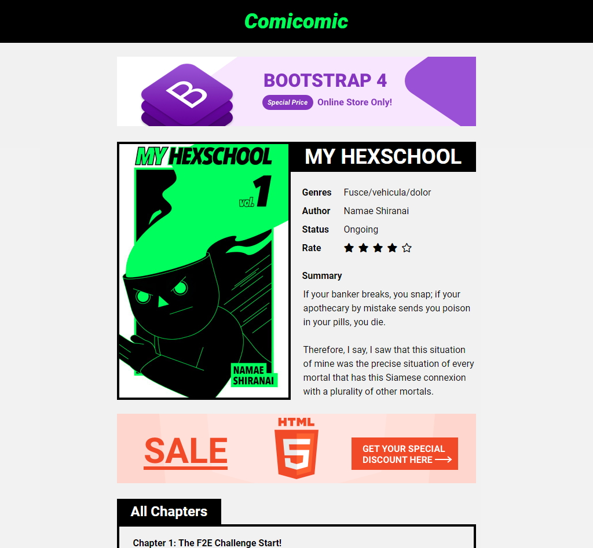

## 【練習作品】漫畫閱讀器 (Comic Viewer)
***
### 練習主題：版型練習、可切換閱讀器樣式、隨機換廣告圖
### 技術：html + CSS + jQuery + JSON資料 + DOM操作
### 頁面展示：<https://zshao1031.github.io/TheF2E-Week-5/>
### 未實作功能：下方縮圖換頁功能

### 預覽圖片：

***
## 【其他說明】
### The F2E 活動：這是由《六角學院》所舉辦的練功活動，每週出一主題(附設計稿)給參加者練習，參與者可自行決定實作到什麼程度，但至少要挑一頁版型來製作。

### 設計稿：https://hexschool.github.io/THE_F2E_Design/week5-comic%20viewer/?fbclid=IwAR3JS50VrqGVTn4fsc9Gry8v2eNYoSsqUfkhC3gxlHYtxGKkjghL5zlcXIY
